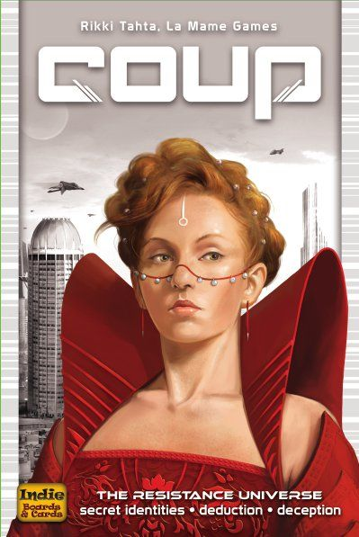

# Coup

## Site

- [local](http://localhost:8000/)
- [Published](https://alexhedley.github.io/coup)

## Game

- https://boardgamegeek.com/boardgame/131357/coup
- http://indieboardsandcards.com/index.php/our-games/coup/

## Run

`py -m http.server`

- [local](http://localhost:8000/)

## License

- [MIT License](LICENSE)
